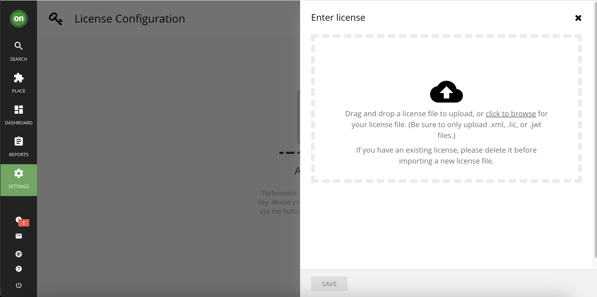

# Installing IBM Turbonomic on IBM ROKS 

This document describes about Installing IBM Turbonomic on IBM ROKS.

Installation scripts are available [here](./files).

## 1. Install Turbonomic

#### 1.1. Login to OCP Cluster

Login to OCP cluster using  `oc login` command .

#### 1.2. Run the install script

Goto the `files` folder and Run the install script as like below.

```
cd files
sh 10-install.sh
```

- It would take around 5 minutes to complete the istallation. 
- By default the installation is done on the namespace `turbonomic`
- Keep checking the logs for the status. 
- The same script can be run again and again if the install stopped for any reason.

#### 1.3. Output
 
The installation would be complete, and the output could be like this:
```
=====================================================================================================
URL : https://nginx-turbonomic.aaaaaaaa.containers.appdomain.cloud/app/
USER: administrator
=====================================================================================================
```

You can use this URL to login to the Turbonomic console.

## 2. Setting up Administrator Password

After you install the turbo, access the above URL and set the password for the first time. The user name by default is `administrator`.


## 3. Importing License

#### 3.1. Download the license file

Download the license file of the below turbonomic partcode.
```
M07FSEN    Turbonomic Application Resource Management On-Prem 8.6 for install on Kubernetes English
```

**IBMers** can use this link to download. https://w3south-limited-use.cpc.ibm.com/software/xl/download/ticket.wss

**Partners** can download from Partner+ site.

#### 3.2. Import the license

Import the license in Turbonomic as highlighed below.




