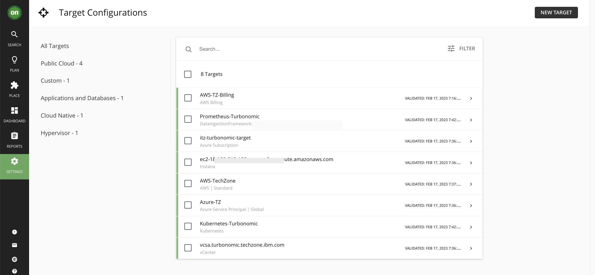

# Configuring Targets for IBM Techzone installed Turbonomic

This document explains how to configure targets for the IBM Turbonomic installed on TechZone.

This can be used by IBMers only.

## Steps

1. Login to the OCP cluster where you have installed Turbonomic using the   `oc login` command.

2. Download the yaml https://github.ibm.com/gsi-labs/turbonomic-tz-target-config/blob/main/turbonomic-usecases-setup.yaml

3. Fill in the Turbonomic password (TURBO_PASSWORD) in the below script

```
export TURBO_NAMESPACE=turbonomic
export TURBO_ADMIN_USER=administrator
export TURBO_PASSWORD=

oc new-app turbonomic-usecases-setup.yaml -p TURBO_NAMESPACE=$TURBO_NAMESPACE -p TURBO_ADMIN_USER=$TURBO_ADMIN_USER -p TURBO_PASSWORD=$TURBO_PASSWORD
```

4. Run the above script in the command prompt.

5. It takes 30 minutes to complete the action and you can see the below targets added in your turbonomic.




