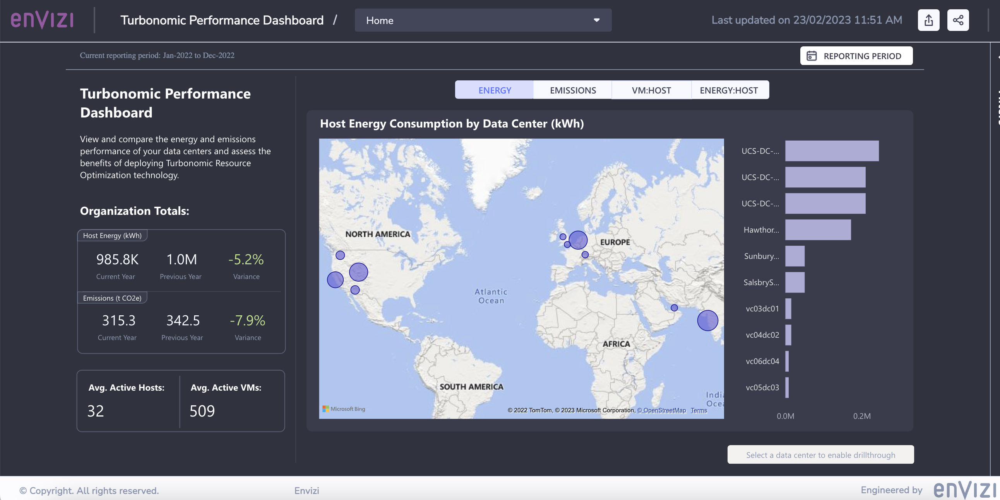
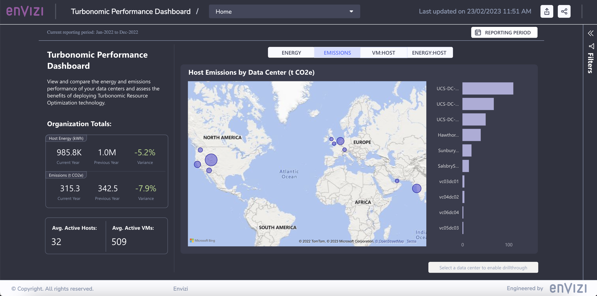
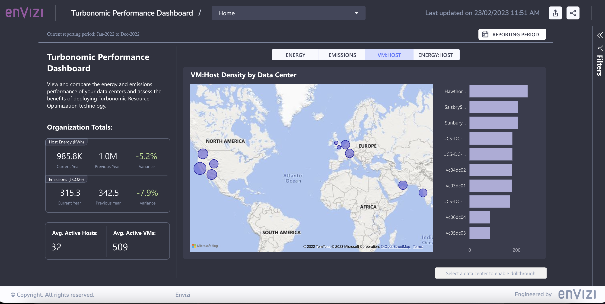
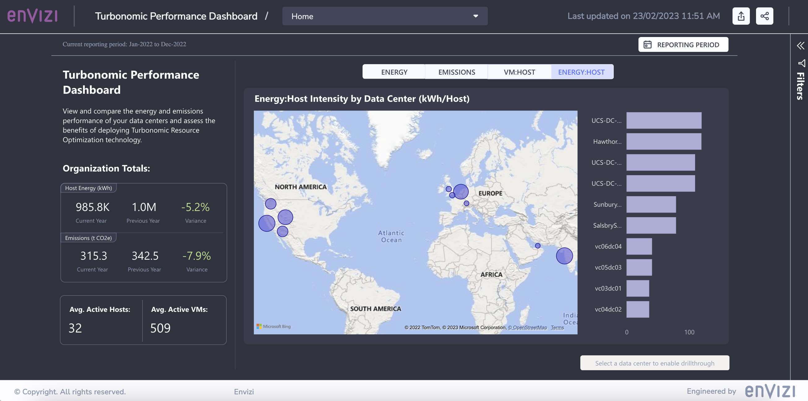
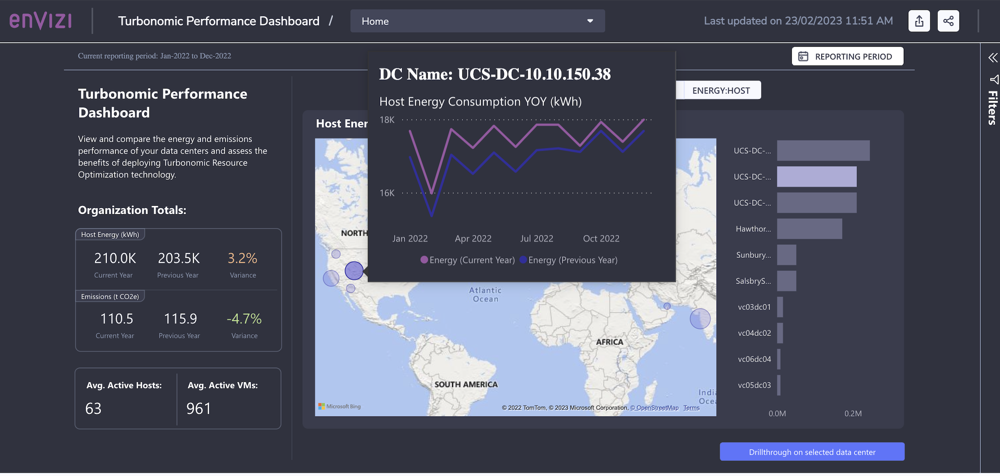
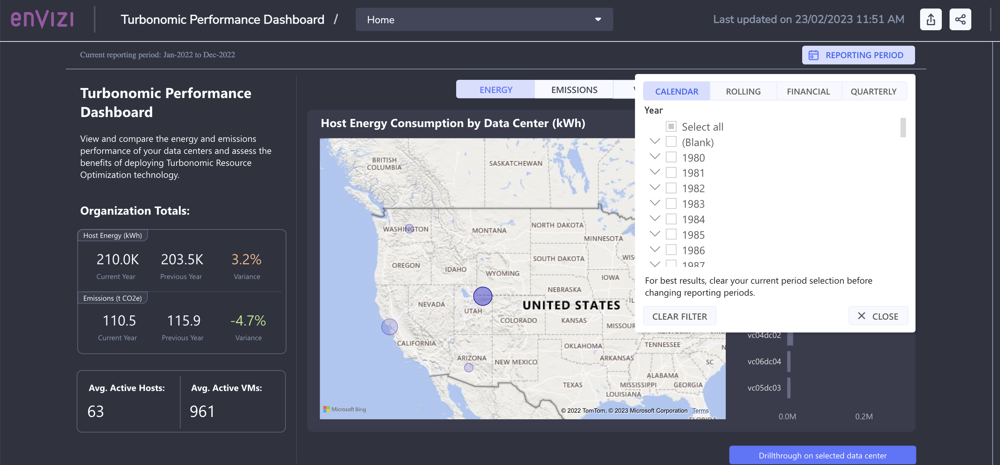
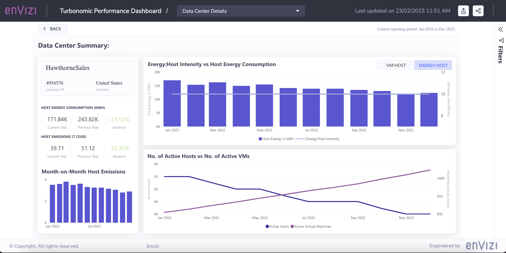
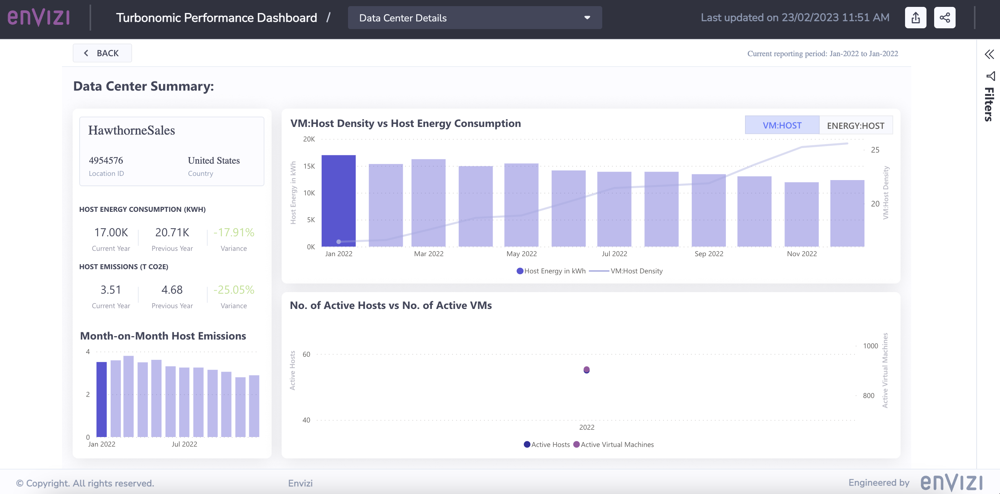

# Envizi - Turbonomic Performance Dashboard 

This document describes the Turbonomic Performance Dashboard in Envizi.

The Turbonomic Performance Dashboard allows to view and compare the energy and emissions performance of your data centers and assess the performance of deploying Turbonomic Resource Optimization technology.

## Dashboard Home

#### 1. Host Energy Consumption by Data Center

The dashboard shows the entire organizations energy and emission perspective. It shows the current year, previous year and Variance. The map shows the various Data Centres across the globe.

#### 2. Host Emissions by Data Center

It shows the host emission by Data Center

#### 3. VM:Host Density by Data Center

It shows the host Density by Data Center

#### 4. Energy:Host Intensity by Data Center

#### 5. Host Energy consumption YoY

The hover of the mouse near to the circle (data center) shows the energy consumption of current year and Previous year of the data center.

#### 7. Reporting Period 

You can change the report period to show the data between the selected dates.

## Data Center Summary

A summary of a particular Data Center can be seen here.

#### 1. VM:Host Density vs Host Energy Consumption

It shows what the energy consumption of the host is and how it is changed over time by taking turbonomic action.

Here, the energy consumption was reduced from 243K to 171K with a variance of 29%. This was the result of the action that was taken by the turbo. Correspondingly it reduces the amount of the emissions.

Also, it shows the month-on-month emissions over a period of time.

Active hosts are reduced from 55 to 40 based on Turbo actions.

#### 2. Energy:Host Intensity vs Host Energy Consumption

It depicts the energy intensity of the host versus the energy consumption of the host.

#### 3. VM:Host Density vs Host Energy Consumption - Jan 2022

It shows the data related to the selected month (Jan 2022)

