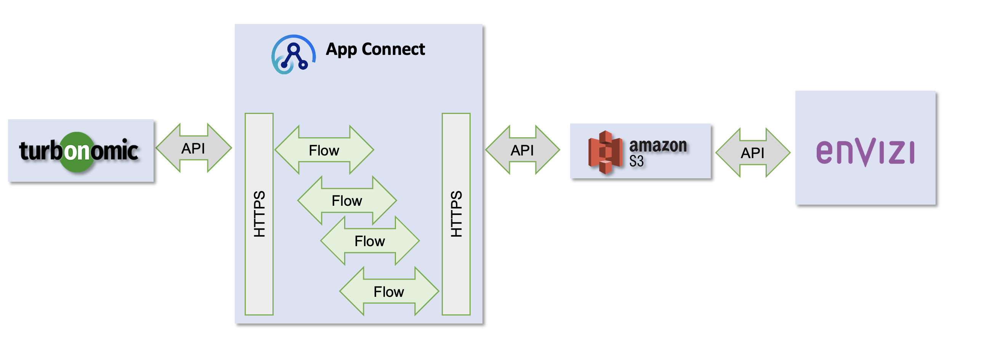

# Envizi and Turbonomic Integration

This article explains the step-by-step instructions to pull green IT data from Turbonomic into Envizi via App Connect and Amazon S3.

#### 1. Installing IBM Turbonomic on IBM ROKS 

This document describes how to install IBM Turbonomic on IBM ROKS.

[01-install-turbonomic](./01-install-turbonomic/)

#### 2. Configuring Targets for IBM Techzone installed Turbonomic

This document describes how to configure targets for the IBM Turbonomic installed on TechZone.

[02-turbo-targets](./02-turbo-targets/)

#### 3. Turbonomic and Envizi Integration using App Connect 

This document describes about how to pull data from Turbonomic using App Connect and pushing it to S3 for further integration with Envizi.

[03-app-connect-configuration](./03-app-connect-configuration/)

#### 4. Envizi - Turbo Performance Dashboard

This document describes the Turbonomic Performance Dashboard available in Envizi.

[04-turbo-performance-dashboard](./04-turbo-performance-dashboard/)

## Reference 

IBM Sustainability Software Portfolio Connectors
https://ibm.github.io/IBM-Sustainability-Software-Portfolio-Connectors/

Turbonomic - Envizi Integration
https://github.com/IBM/turbonomic-envizi-appconnect-flows
